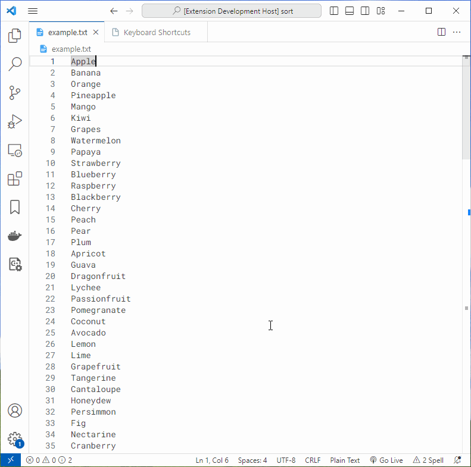

# vsc-sort-text

A VSCode extension for sorting text.

## Usage

Select the text to be sorted (multi-cursors are also supported), then call up the Command Palette (`Shift+ Command + P` (Mac) / `Ctrl + Shift + P` (Windows/Linux)), enter `Sort Text` to filter and select the appropriate sorting method.

## Features

- Sort selected text

## Requirements

- VS Code [`1.64.0`](https://code.visualstudio.com/updates/v1_64) or higher

## Extension Settings

N/A

## Known Issues

Run into a bug? Report it [here](https://github.com/dsyx/vsc-sort-text/issues).

## Release Notes

Detailed release notes are available [here](https://github.com/dsyx/vsc-sort-text/releases).
